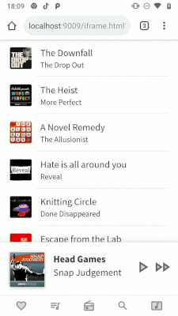

# Mobile First Animation in React

[View this repo as a live demo in CodeSandbox](https://codesandbox.io/s/github/aholachek/mobile-first-animation).

This repo contains the source code of the demos for [this talk about mobile animation in React](https://www.youtube.com/watch?v=JDDxR1a15Yo&feature=youtu.be&t=10664).

[The interactive slides for the talk can be found here.](http://mobile-first-animation.netlify.com)

You can also play with the [spring demo from the talk here.](https://spring-playground.netlify.com/)

[View this repo as a live demo in CodeSandbox.](https://codesandbox.io/s/github/aholachek/mobile-first-animation)

### Notes:

- If you find any bugs or UI inconsistencies, please make an issue!
- These are animation demos and as such they are not production-ready UI code. They are not fully accessible, and don't have desktop variants.
